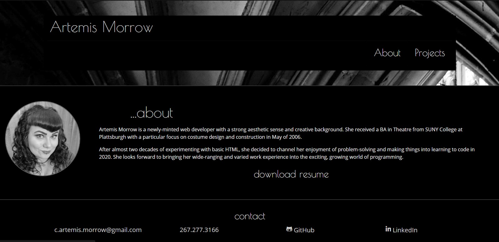
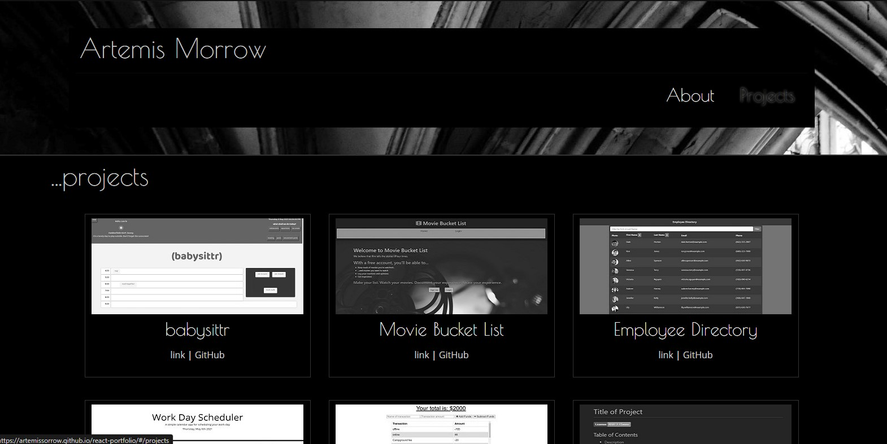

# Portfolio (now with React!)

A fresh, new portfolio page redesigned from the ground up using [React](https://reactjs.org/).

## Requirements

- Updated portfolio featuring 6 total projects
- Use React
- A `Header` component that appears on multiple pages
- A single `Project` component that will be used multiple times on a single page 
- Navigation with React Router, dynamic rendering, or another third part router
- A `Footer` component that appears on multiple pages

## Execution

Uses Header and Footer components for navigation and contact, respectively. Project card is a reusable component, with the projects page generated by mapping over an array of projects to fill each card with the relevant image, title, and links. Resume can be downloaded as a pdf from the "About" page.  
  
Routing is done via [React Router](https://reactrouter.com/). Favicon from [Twemoji](https://twemoji.twitter.com/) via [favicon.io](https://favicon.io/) licensed under [CC BY 4.0](https://creativecommons.org/licenses/by/4.0/). Header background image photo by [Adrien Olichon](https://unsplash.com/@adrienolichon?utm_source=unsplash&utm_medium=referral&utm_content=creditCopyText) on [Unsplash](https://unsplash.com/s/photos/gothic-architechture?utm_source=unsplash&utm_medium=referral&utm_content=creditCopyText). Design inspired by the [1931 Universal film version of *Dracula*](https://en.wikipedia.org/wiki/Dracula_(1931_English-language_film)).

## Challenges

Linking and routing, to images, the resume pdf, and the background image in particular were all kind of an adventure in React. It all got sorted eventually, but the routing and styling definitely took some trial and error. In future development it would also be great to add a description of each project that overlays the screenshot on hover, but there just wasn't time with the assignment deadline here.

## Link and Screenshots

[Link to Deployed App](https://artemissorrow.github.io/react-portfolio/)  
  

  